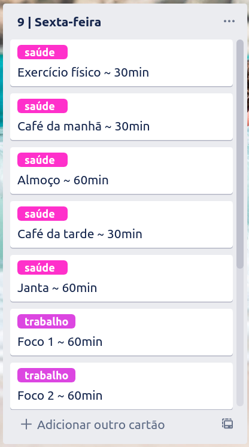

# planner

Planner is a CLI to automate daily and weekly planning in Trello, the app I use the most for daily planning and organization.

## What is expected

`planner week` command is able to create a standard week I use with each label in each card for the next 7 days. Something like this:

## Roadmap

- [X] List all boards
- [X] List all lists in a board
- [X] Create a list in a board
- [X] Create a card in a list
- [X] Add labels to a card
- [X] Plan week